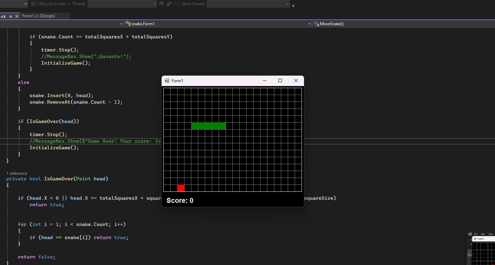

# Snake Game

## Description (English)

This is a simple implementation of the classic **Snake Game** using **C#** and **Windows Forms**. The player controls a snake that moves across the screen, and the objective is to eat food items to grow longer. The game ends if the snake collides with the walls or its own body.

### Key Features:
- **Real-time gameplay**: The snake moves continuously, and the player must react quickly to guide it using the arrow keys.
- **Score System**: Each time the snake eats, the score increases.
- **End game conditions**: Game over occurs if the snake hits the edges of the game area or runs into itself.
- **Responsive design**: The game dynamically adjusts to the window size.

### Requirements
- .NET Framework
- Windows Forms
- Visual Studio (for running the project)

### How to Play
1. Start the game by running the application.
2. Use the arrow keys on your keyboard to move the snake (Up, Down, Left, Right).
3. Avoid running into the walls or the snake’s own body.
4. Eat the food (represented by small squares) to grow longer.
5. Try to achieve the highest possible score before the game ends.

### Installation
1. Clone the repository to your local machine.
2. Open the project in Visual Studio.
3. Build the solution and run the application.

---

## Juego de la Culebrita

### Descripción (Español)

Esta es una implementación simple del clásico **Juego de la Culebrita (Snake)** utilizando **C#** y **Windows Forms**. El jugador controla una serpiente que se mueve por la pantalla, y el objetivo es comer objetos de comida para crecer. El juego termina si la serpiente choca contra las paredes o contra su propio cuerpo.

### Características principales:
- **Juego en tiempo real**: La serpiente se mueve continuamente y el jugador debe reaccionar rápido para guiarla usando las teclas de flecha.
- **Sistema de puntuación**: Cada vez que la serpiente come, la puntuación aumenta.
- **Condiciones de fin de juego**: El juego termina si la serpiente choca con los bordes del área de juego o si se muerde a sí misma.
- **Diseño adaptable**: El juego se ajusta dinámicamente al tamaño de la ventana.

### Requisitos
- .NET Framework
- Windows Forms
- Visual Studio (para ejecutar el proyecto)

### Cómo jugar
1. Inicia el juego ejecutando la aplicación.
2. Usa las teclas de flecha en tu teclado para mover la serpiente (Arriba, Abajo, Izquierda, Derecha).
3. Evita chocar contra las paredes o contra el cuerpo de la serpiente.
4. Come los objetos de comida (representados por pequeños cuadrados) para hacerte más grande.
5. Intenta conseguir la mayor puntuación posible antes de que termine el juego.

### Instalación
1. Clona el repositorio a tu máquina local.
2. Abre el proyecto en Visual Studio.
3. Compila la solución y ejecuta la aplicación.

---

### Screenshot:

